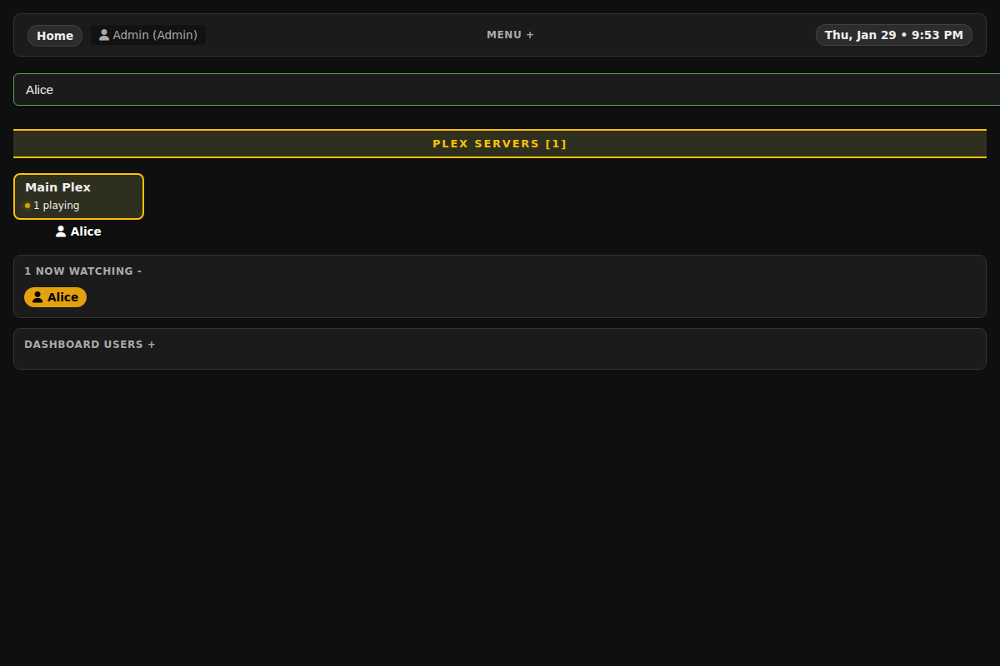

# MultiDash - Media Server Dashboard

A lightweight, self-hosted dashboard for monitoring multiple Plex, Emby, and Jellyfin media servers in a unified interface.


## Features

*   **Unified Monitoring:** View active sessions from multiple Plex, Emby, and Jellyfin servers in a single grid.
*   **Search & Filter:** Instantly filter servers and users. Matching user sessions are displayed directly on the server card with visual icons.
*   **Real-time Updates:** Auto-refreshing status for "Now Watching" and dashboard users.
*   **Dynamic Server Management:** Easily add and edit servers using a modal interface with protocol selection and validation.
*   **Server Administration:** Check for updates and remotely restart servers via SSH or API.
*   **Library Management:** List and trigger scans for media libraries on connected Plex, Emby, and Jellyfin servers.
*   **User Management:** Built-in authentication with Admin and Viewer roles.
*   **Logging System:** Comprehensive system logging with a built-in "tailable" log viewer.
*   **Mobile Friendly:** Responsive dark-mode UI ("MultiDash") that adapts to any screen size.
*   **Secure:** Encrypted storage for API keys and tokens.

## Screenshots

### Login & Security
Secure login system with role-based access control.


### Search & Filtering
Filter servers by name or currently active user. Matches are highlighted directly on the grid.


### Server Management
Easily add, edit, and reorder your media servers via a user-friendly modal.


### User Administration
Manage dashboard users directly from the interface.


## Installation

### Prerequisites
*   Web server (Apache/Nginx) with PHP 7.4+
*   Write permissions for the installation directory (for JSON databases and logs)
*   `php-curl` and `php-openssl` extensions enabled
*   `ssh-keygen` (optional, for SSH server management)

### Setup

1.  **Clone the repository:**
    ```bash
    git clone https://github.com/yourusername/multidash.git /var/www/html/dash
    cd /var/www/html/dash
    ```

2.  **Set Permissions:**
    Ensure the web server user (e.g., `www-data`) can write to the directory.
    ```bash
    chown -R www-data:www-data /var/www/html/dash
    chmod -R 755 /var/www/html/dash
    ```

3.  **Run the Wizard:**
    Navigate to `http://your-server/dash/` in your browser. You will be redirected to the setup wizard to create your admin account.

4.  **Add Servers:**
    Log in and use the "Add Server" button in the menu to connect your Plex, Emby, or Jellyfin instances.
    *   **Emby/Jellyfin:** Requires your server URL and an API Key.
    *   **Plex:** Requires your server URL and an X-Plex-Token.

## SSH Remote Control Setup (Linux Only)

To enable the "Restart Server" feature via SSH, you must configure your media servers to accept SSH commands from the dashboard. This feature is designed to be secure by using a restricted user and key-based authentication. **This feature is supported on Linux media servers only.**

### 1. Generate Keys
Go to **Admin > Server Administration > SSH Keys** in the dashboard and click "Generate New Key Pair". Copy the generated Public Key.

### 2. Configure Remote Media Server (Automated Method)
We provide a helper script to automate the secure setup process.

1.  SSH into your media server and run the script:
    ```bash
    curl -fsSL https://bntv.ca/dash/os_helpers/linux_setup.sh | sudo bash -s install
    ```
2.  Choose **Option 1 (Install)** and paste the Public Key when prompted.

To remove the configuration later, simply run the script again and choose **Option 2 (Uninstall)**.

### 3. Configure Remote Media Server (Manual Method)
If you prefer to configure the server manually, follow these steps:

**Step 1: Create a restricted user**
```bash
sudo adduser --disabled-password --gecos "" mediasvc
```

**Step 2: Add Public Key**
Paste the Public Key from the dashboard into the authorized_keys file:
```bash
sudo mkdir -p /home/mediasvc/.ssh
sudo bash -c 'echo "YOUR_PUBLIC_KEY_HERE" >> /home/mediasvc/.ssh/authorized_keys'
sudo chown -R mediasvc:mediasvc /home/mediasvc/.ssh
sudo chmod 700 /home/mediasvc/.ssh
sudo chmod 600 /home/mediasvc/.ssh/authorized_keys
```

**Step 3: Restrict sudo access**
Allow the user to only run specific service commands without a password:
```bash
sudo bash -c 'cat >> /etc/sudoers.d/mediasvc' << 'EOF'
mediasvc ALL=(ALL) NOPASSWD: \
  /bin/systemctl start plexmediaserver, \
  /bin/systemctl stop plexmediaserver, \
  /bin/systemctl restart plexmediaserver, \
  /bin/systemctl start emby-server, \
  /bin/systemctl stop emby-server, \
  /bin/systemctl restart emby-server, \
  /bin/systemctl start jellyfin, \
  /bin/systemctl stop jellyfin, \
  /bin/systemctl restart jellyfin
EOF

sudo chmod 440 /etc/sudoers.d/mediasvc
```

**Step 4: Lock down SSH access (Optional but Recommended)**
Restrict what this user can do over SSH in `/etc/ssh/sshd_config`:
```bash
sudo bash -c 'cat >> /etc/ssh/sshd_config' << 'EOF'

# BEGIN MEDIASVC-MULTIDASH
Match User mediasvc
    AllowTcpForwarding no
    X11Forwarding no
    PermitTTY no
# END MEDIASVC-MULTIDASH
EOF

sudo systemctl reload ssh
```

#### Security Analysis: Why is this secure?
The above instructions adhere to the **Principle of Least Privilege**:
*   **Restricted User:** The `mediasvc` user has no password and cannot be logged into interactively via password.
*   **Limited Sudo:** The `sudoers` file explicitly whitelists *only* the `systemctl start/stop/restart` commands for specific media services. This user cannot modify files, install software, or access other parts of the system as root.
*   **SSH Lockdown:** The `sshd_config` settings prevent port forwarding (tunneling), X11 forwarding, and TTY allocation. This means even if an attacker gains access to the private key, they cannot get an interactive shell or use your server as a pivot point to attack your network. They can *only* execute the whitelisted commands.

### 4. Configure Dashboard
In the **Add/Edit Server** modal for your server:
*   Select **Linux** as the Operating System.
*   If your server uses a standard SSH port (22), no further configuration is needed.
*   The dashboard will automatically connect to the server's IP (derived from the Proxy URL) as the `mediasvc` user and execute the correct restart command for your server type.

## Configuration

Data is stored in local JSON files (no database required):
*   `users.json`: User accounts (passwords are hashed).
*   `servers.json`: Server configurations (API keys/tokens are encrypted).
*   `activity.json`: Tracks active dashboard users.
*   `watcher_state.json`: Tracks media playback state for logging.
*   `dashboard.log`: System event logs.
*   `key.php`: Auto-generated encryption key (do not share this file!).
*   `keys/`: Stores generated SSH key pairs (protected).

## Security Note

*   **Encryption:** API keys and tokens are encrypted using AES-256-CBC.
*   **SSH Keys:** Private keys are stored with strict `0600` permissions and blocked from web access.
*   **File Access:** Direct access to `.json` and `.log` files is blocked via `.htaccess` (ensure AllowOverride is enabled in Apache).
*   **HTTPS:** It is strongly recommended to run this dashboard behind HTTPS, especially if exposed to the internet.

## Deployment

See [DEPLOYMENT.md](DEPLOYMENT.md) for detailed deployment instructions including Nginx configuration examples.
