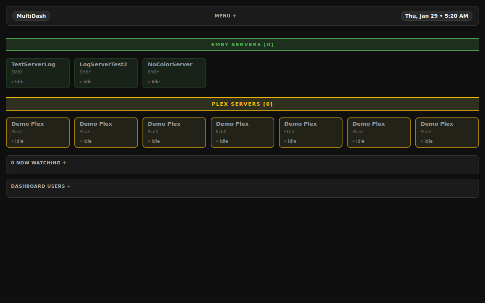
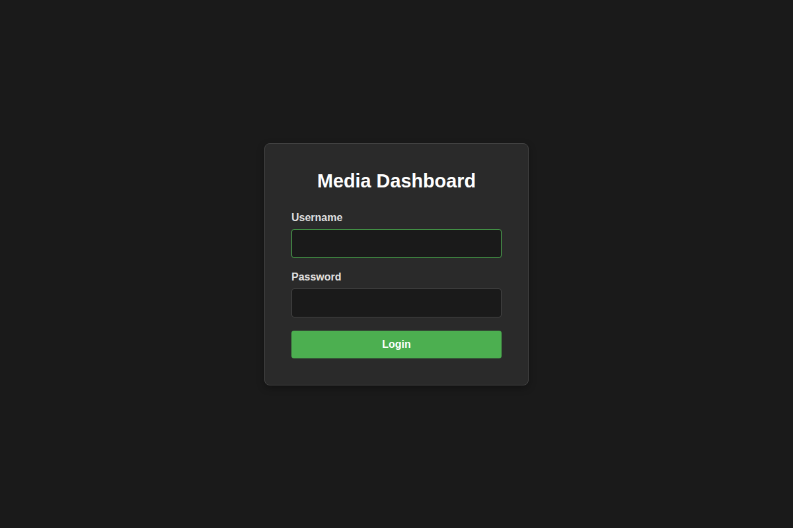
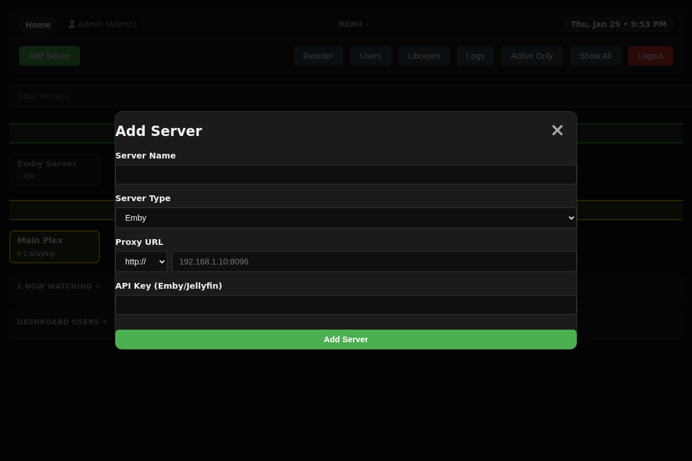
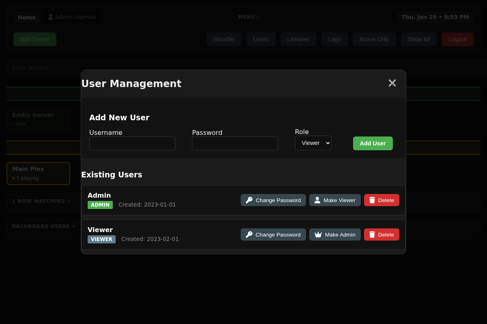
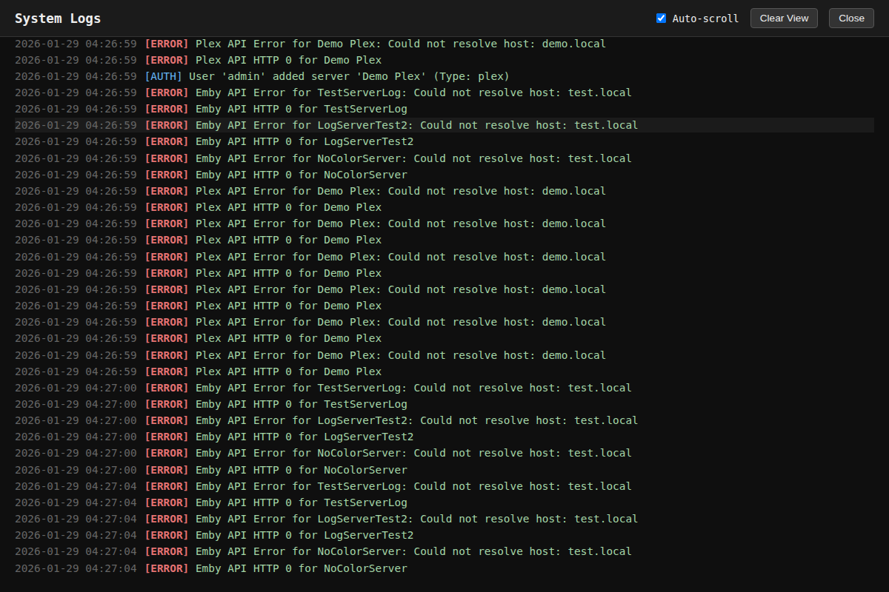

# MultiDash - Media Server Dashboard

A lightweight, self-hosted dashboard for monitoring multiple Plex and Emby media servers in a unified interface.



## Features

*   **Unified Monitoring:** View active sessions from multiple Plex and Emby servers in a single grid.
*   **Real-time Updates:** Auto-refreshing status for "Now Watching" and dashboard users.
*   **Library Management:** List and trigger scans for media libraries on connected Plex and Emby servers.
*   **User Management:** Built-in authentication with Admin and Viewer roles.
*   **Logging System:** Comprehensive system logging with a built-in "tailable" log viewer (filterable by level and search).
*   **Mobile Friendly:** Responsive dark-mode UI that works great on mobile devices.
*   **Secure:** Encrypted storage for API keys and tokens.

## Screenshots

### Login & Security
Secure login system with role-based access control.


### Server Management
Easily add, edit, and reorder your media servers.


### User Administration
Manage dashboard users directly from the interface.


### System Logs
Monitor system events, user actions, and media playback activity in real-time.


## Installation

### Prerequisites
*   Web server (Apache/Nginx) with PHP 7.4+
*   Write permissions for the installation directory (for JSON databases and logs)
*   `php-curl` and `php-openssl` extensions enabled

### Setup

1.  **Clone the repository:**
    ```bash
    git clone https://github.com/yourusername/multidash.git /var/www/html/dash
    cd /var/www/html/dash
    ```

2.  **Set Permissions:**
    Ensure the web server user (e.g., `www-data`) can write to the directory.
    ```bash
    chown -R www-data:www-data /var/www/html/dash
    chmod -R 755 /var/www/html/dash
    ```

3.  **Run the Wizard:**
    Navigate to `http://your-server/dash/` in your browser. You will be redirected to the setup wizard to create your admin account.

4.  **Add Servers:**
    Log in and use the "Add Server" button in the menu to connect your Plex or Emby instances.
    *   **Emby:** Requires your server URL and an API Key.
    *   **Plex:** Requires your server URL and an X-Plex-Token.

## Configuration

Data is stored in local JSON files (no database required):
*   `users.json`: User accounts (passwords are hashed).
*   `servers.json`: Server configurations (API keys/tokens are encrypted).
*   `activity.json`: Tracks active dashboard users.
*   `watcher_state.json`: Tracks media playback state for logging.
*   `dashboard.log`: System event logs.
*   `key.php`: Auto-generated encryption key (do not share this file!).

## Security Note

*   **Encryption:** API keys and tokens are encrypted using AES-256-CBC.
*   **File Access:** Direct access to `.json` and `.log` files is blocked via `.htaccess` (ensure AllowOverride is enabled in Apache).
*   **HTTPS:** It is strongly recommended to run this dashboard behind HTTPS, especially if exposed to the internet.

## Deployment

See [DEPLOYMENT.md](DEPLOYMENT.md) for detailed deployment instructions including Nginx configuration examples.
